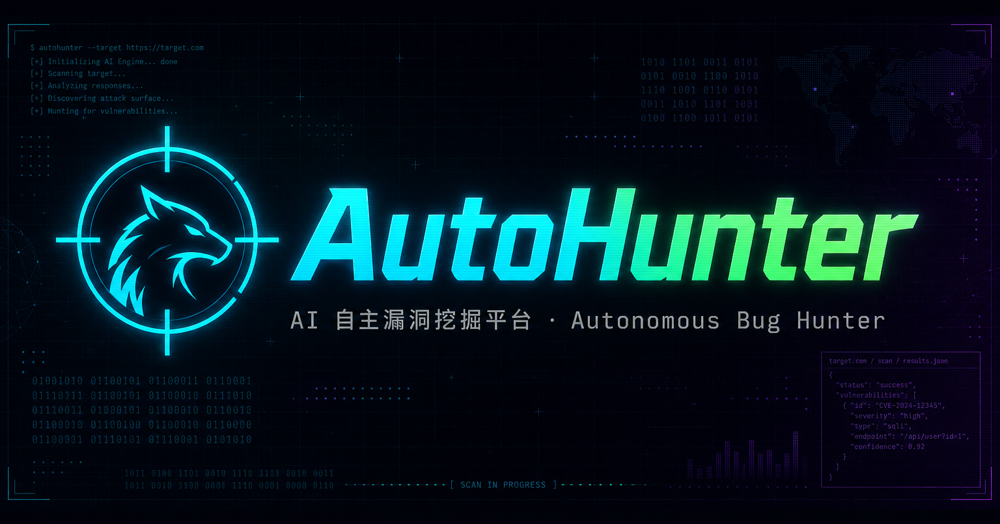
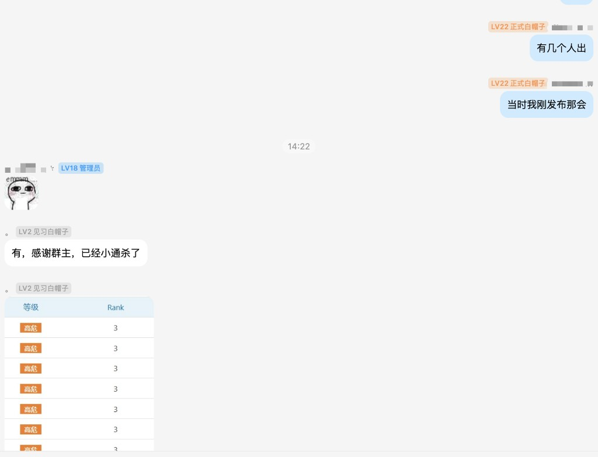

<div align="center">



多 Agent 协同 · 24×7 自动挖洞 · 人工只做复审决策

`锁定 · 侦察 · 出洞`

Powered By **StanleyNull** · License: CC BY-NC 4.0

作者 EDUSRC 主页：<https://src.sjtu.edu.cn/profile/46491/>

🌱 **本项目为 Demo 级别，作者抛砖引玉，希望对大家有所帮助。**

**战绩可查**



</div>

---

## 这是什么

AutoHunter 是一个**多 Agent 协同的自动化漏洞挖掘系统**。你把一台机器交给它当作 7×24 小时不停歇的挖洞平台，自己只做「人工复审员」：

```
Collector（搜集）  →  Worker（1:1 真实挖洞）  →  Reviewer（AI 初审去垃圾）  →  人工复审 → 待提交
     ↑ FOFA/手动录目标        ↑ LLM + 真实工具链（httpx/Katana/FFUF/Arjun/JS 与证据分析…）
```

- **Collector**：从 FOFA 持续产出目标，探活、预筛、评分、归属标注后入队。
- **Worker**：每个目标一个 Worker，LLM 自主侦察 + 调用真实工具挖洞，出洞即提交。
- **Reviewer**：极理性 AI 初审，过滤半成品/误报，只把够格的洞送到人工面前。
- **控制台**：实时看板一眼看清每个 Worker 在干什么、目标优先级、事件流；结果区高效复审、编辑、标记提交。
- **归属标注**：写报告时按目标 IP/域名离线反查所属高校（`app/data_static/edu_ip.db`），自动填充报告归属单位与 EduSRC 提交 JSON 的标题/单位；重建脚本见 `tools/edu_ip_builder/`。

> ⚠️ **仅限对已获明确书面授权的目标使用。** 本工具遵循 CC BY-NC 4.0，禁止商用。滥用后果自负。

---

## 各平台环境准备

AutoHunter 全程基于 **Docker + Docker Compose v2** 运行，任意装得上 Docker 的系统都能跑。下面按平台给出准备步骤，装好 Docker 后统一走 [一键部署](#一键部署推荐) 或 [手动部署](#手动部署)。

<details open>
<summary><b>🐧 Linux 服务器（推荐，Ubuntu / Debian / CentOS）</b></summary>

生产环境首选。2C4G 起步，磁盘 ≥ 20G。

```bash
# 1. 安装 Docker（官方一键脚本，适配主流发行版）
curl -fsSL https://get.docker.com | sh
sudo systemctl enable --now docker

# 2. 把当前用户加入 docker 组（免 sudo，重登生效）
sudo usermod -aG docker $USER && newgrp docker

# 3. 验证
docker version && docker compose version

# 4. 拉代码 + 部署
git clone https://github.com/StanleyNull/AutoHunter.git autohunter && cd autohunter
bash scripts/install.sh
```

**开放端口**（默认 18800）：

```bash
# Ubuntu/Debian(ufw)
sudo ufw allow 18800/tcp
# CentOS/RHEL(firewalld)
sudo firewall-cmd --permanent --add-port=18800/tcp && sudo firewall-cmd --reload
```

> 云服务器还需在厂商**安全组**里放行 18800（或你自定义的 `AUTOHUNTER_HOST_PORT`）。

**SSH 断开后仍要运行**：容器由 Docker 守护，`docker compose up -d` 已是后台运行，关掉 SSH 不影响。可选设开机自启见下方 [服务器长期运行](#服务器长期运行--开机自启)。

</details>

<details>
<summary><b>🪟 Windows（Docker Desktop + WSL2）</b></summary>

适合本地跑 / 自用。Windows 10/11 均可。

1. **装 WSL2**（管理员 PowerShell）：
   ```powershell
   wsl --install
   ```
   装完重启。

2. **装 [Docker Desktop](https://www.docker.com/products/docker-desktop/)**：安装时勾选 “Use WSL 2 based engine”，启动后在 Settings → Resources → WSL Integration 打开集成。

3. **拉代码 + 部署**（在 PowerShell 或 WSL 终端里）：
   ```powershell
   git clone https://github.com/StanleyNull/AutoHunter.git autohunter
   cd autohunter
   bash scripts/install.sh
   ```
   > `install.sh` 是 bash 脚本，在 **WSL / Git Bash** 里跑最顺。若只用 PowerShell，也可走 [手动部署](#手动部署)：`copy .env.example .env`，编辑后 `docker compose up -d --build`。

4. 浏览器访问 `http://localhost:18800/`。

> 💡 Windows 下代码放在 **WSL 文件系统内**（如 `~/autohunter`）比放在 `C:\` 挂载盘性能好很多。

</details>

<details>
<summary><b>🍎 macOS（Docker Desktop）</b></summary>

1. 装 [Docker Desktop for Mac](https://www.docker.com/products/docker-desktop/)（Apple Silicon / Intel 均支持），启动它。
2. 部署：
   ```bash
   git clone https://github.com/StanleyNull/AutoHunter.git autohunter && cd autohunter
   bash scripts/install.sh
   ```
3. 访问 `http://localhost:18800/`。

</details>

---

## 一键部署（推荐）

> 前置：一台 Linux 服务器（2C4G 起步，磁盘 ≥ 20G），已装 [Docker](https://docs.docker.com/engine/install/) + Docker Compose v2。

```bash
# 1. 拉取代码
git clone <your-repo-url> autohunter && cd autohunter

# 2. 运行引导脚本（带字符画，交互式采集必填参数，自动生成 .env、构建并启动）
bash scripts/install.sh
```

脚本会：检查 Docker 环境 → 引导你填 **LLM API Key**（必填）、**FOFA Key**（推荐）→ 自动生成高强度访问令牌 → 构建镜像并启动 → 打印访问地址和令牌。

> 首次构建会编译前端，并安装 HTTPX、Katana、FFUF、Arjun、wafw00f、Nmap、WhatWeb，以及仅供非企业模式定向验证的 Nuclei、Dalfox、SQLMap，约 5–15 分钟，请耐心等待。企业 SRC 的工具限制见下方[模式矩阵](#企业与非企业模式矩阵)；镜像内存在某个二进制不代表该模式允许调用。

---

## 手动部署

```bash
cp .env.example .env
# 编辑 .env：至少填 LLM_API_KEY；建议填 FOFA_KEY 和 AUTOHUNTER_API_TOKEN
vim .env

docker compose up -d --build
docker compose logs -f autohunter   # 看启动日志
```

启动后访问 `http://<服务器IP>:18800/`，用你在 `.env` 里设置的 `AUTOHUNTER_API_TOKEN` 登录。

---

## 创建任务：配置怎么填

登录控制台 → 「新建挖掘任务」，各字段含义如下：

| 字段 | 填什么 | 说明 |
|------|--------|------|
| **任务名称** | 随便起，方便自己区分 | 如 `edu批量挖掘-2026` |
| **任务模式** | `EduSRC` / `企业SRC` | 决定评分口径和审核标准，教育资产选 EduSRC |
| **漏洞类型** | 中文复选项 | 默认全选 SQL 注入、远程代码执行、未授权访问、越权访问、文件上传、验证码绕过 |
| **目标来源** | `FOFA 自动搜` / `手动清单` / `两者` / `单站协作` | 想让它自己找目标就选 FOFA |
| **搜集方式** | `自动判断` / `FOFA 语法` / `自然语言意图` | 见下方说明 |
| **FOFA 语法 / 搜集意图** | 你的查询语句或大白话 | 见下方示例 |
| **手动目标清单** | 每行一个 URL | 选了「手动/两者/单站」时填 |

### 两种搜集方式

**① 我自己会写 FOFA 语法** → 搜集方式选 `FOFA 语法`，直接把语句粘进去。例如挖教育网（CERNET）下带「管理」后台的资产：

```text
body="管理" && org="China Education and Research Network Center"
```

**② 不会写语法，只想说要找什么** → 搜集方式选 `自然语言意图`，用大白话描述，搜集 Agent 会自动翻译成 FOFA 语法并逐轮演化。例如：

```text
找全国高校的统一身份认证登录系统
找某集团的 OA / CRM / ERP / API 网关 / 运维后台资产
```

> 留空「搜集方式」= **自动判断**：写得像语法就当语法，否则当意图，新手直接用这个即可。

### FOFA 语法速查（常用字段）

| 字段 | 含义 | 示例 |
|------|------|------|
| `title=` | 网页标题 | `title="后台管理"` |
| `body=` | 网页正文包含 | `body="管理"` |
| `domain=` | 域名 | `domain=".edu.cn"` |
| `host=` | 主机名 | `host="admin.example.com"` |
| `org=` | 所属机构（归属收窄利器） | `org="China Education and Research Network Center"` |
| `cert=` / `cert.subject.org=` | 证书信息 | `cert.subject.org="某某大学"` |
| `port=` / `country=` | 端口 / 国家 | `port="8080" && country="CN"` |

组合逻辑：`&&`（且）、`||`（或）、`!=`（非）。**语句越精确、归属越收窄，Worker 越不会打到范围外资产。**

### 高级选项（可留空，用服务端默认）

展开「高级」可选择使用**全局 Provider 池**，或按任务固定 `base_url`/`api_key`/模型名/协议/温度；还可覆盖 Worker 提示词版本、FOFA key、FOFA 最大页数和 Worker 并发数。默认使用全局池。

> ⚠️ **务必收窄授权范围**：只搜你有权限测试的资产。`org` / `domain` / `cert` 是最有效的归属过滤手段。

### Worker 工具使用方法与场景

工具由 Worker 根据当前响应自动选择，通常不需要人工逐个调用。任务的「挖掘方向」可以明确要求优先走某条链路，例如“先提取 OpenAPI，再重点验证对象级权限边界”。

| 工具 | 使用方法 | 适用场景 |
|------|----------|----------|
| `http_request` | 传完整 URL、方法、请求头和请求体，获取真实状态码、响应头、正文和请求包 | 所有 HTTP 基线、候选和取证请求的首选入口 |
| `extract_http_surface` | 优先直接传页面 `url`，工具会内部获取完整的有界 HTML；已有完整内容时也可传 `body`/`base_url`/响应头 | 登录页、后台页、服务端渲染页面；提取表单、上传字段、脚本和 API/管理路径 |
| `analyze_javascript` | 传入口 URL 或已经取得的 JS 文本 | Vue/React/SPA、前端路由、隐藏 API、签名参数、硬编码配置和密钥线索 |
| `analyze_api_schema` | 优先直接传文档 `url`，工具会内部获取完整的有界文档；已有完整 JSON 时可传 `document`，可附 `base_url` 和关注关键词 | Swagger/OpenAPI 暴露；按鉴权、对象参数、读写方法和业务敏感度排序接口 |
| `analyze_auth_material` | 传已取得的请求头、响应头或正文 | 识别 Authorization、Cookie、JWT、API Key 头、CSRF 字段和会话属性；完整令牌只保留指纹 |
| `session_set` | 登记已经取得的 Cookie 或 Authorization 等请求头 | 登录成功、拿到 Token 或切换测试身份后，后续 `http_request` 自动保持会话 |
| `compare_http_responses` | 传入基线响应和候选响应，可指定忽略的动态 JSON 路径 | IDOR/BOLA、未授权、身份切换、修改前后状态；量化状态码、关键头和 JSON 路径差异 |
| `decode_transform` | 传 token/编码串并选择 `auto/base64/hex/url/jwt/hash` | JWT 结构、Base64/Hex 参数、URL 编码和哈希类型识别 |
| `suggest_waf_bypass` | 传被拦截的最小 payload、状态码、响应头和正文 | 明确验证请求遇到 403/406/429 或拦截页；输出少量候选变形后必须重新实测 |
| `fofa_lookup` | 传精确 FOFA 语法和小样本数量 | 确认裸 IP 归属、同 IP/同域服务和隐藏端口，不替代漏洞验证 |
| `run_shell` | 传具体命令和超时；优先用于 curl 或短脚本构造单请求 | 已知入口的最小复现、格式转换和本地辅助；企业 SRC 严禁借此调用 Nuclei 类自动化漏洞扫描器 |
| `check_duplicate_finding` | 传漏洞类型、标题和 URL | 提交前查询统一查重库，避免重复报告 |
| `report_intel` | 上报已验证的端点、凭证状态或技术画像 | 把可复用情报提供给后续同系统 Worker；失败和猜测不沉淀 |
| `report_coverage` | 上报已验证端点、剩余入口和覆盖缺口 | 单站多路线协作，避免后续 Worker 重复测试同一批接口 |
| `submit_finding` | 填完整 Finding、自检、原始请求响应和利用链 | 已形成真实影响并满足证据门槛时提交原始发现 |
| `finish` | 填 `found/no_vuln`、总结和可选 `deepen_lead` | 当前 Worker 收尾；线索真实但差一步时明确下一轮接口、参数和动作 |

#### SRC CLI 工具

以下工具均由 Worker 以结构化参数调用，命令使用独立参数数组执行，不经过 shell 拼接。示例只展示最小参数；请求头、Cookie 等敏感值会在展示命令中脱敏。

| 工具 | 最小用法 | 适用场景 | 执行边界与结果处理 |
|------|----------|----------|------------------|
| `probe_http`（HTTPX） | `{"url":"https://host/","rate_limit":20}` | 初次进入目标时确认状态码、标题、技术栈、Server、IP 和 CNAME，建立 HTTP 基线 | 仅当前目标主机；速率最高 50 req/s、单请求超时最高 30 秒。指纹不是漏洞，后续用 `http_request` 取证 |
| `crawl_endpoints`（Katana） | `{"url":"https://host/","depth":2,"js_crawl":true}` | SPA、登录后页面、JS 较多的站点；补全页面、表单、脚本和带参端点 | 仅当前 FQDN；深度最高 3、并发最高 10，并限制爬取时长、页面数和响应大小。优先复核认证、上传、导出和管理端点 |
| `discover_content`（FFUF） | `{"url":"https://host/FUZZ","wordlist":"api"}` | 已确认存在 Web 服务，但页面或 JS 未暴露完整的 API、后台、文档、上传等高价值路径 | URL 必须包含 `FUZZ`；只能选仓库内置 `common/api` 小字典；线程最高 20、速率最高 50 req/s。命中后须排除软 404 和统一跳转 |
| `discover_parameters`（Arjun） | `{"url":"https://host/api/item","method":"GET"}` | 已知业务端点疑似存在隐藏的对象、租户、分页、导出或鉴权参数 | 仅使用内置小参数字典；方法限 `GET/POST/JSON/XML`，线程最高 5、速率最高 20 req/s。发现参数后先用无害值做基线与候选对比 |
| `scan_nuclei`（Nuclei） | `{"url":"https://host/","template_id":["TEMPLATE_ID"]}` | **仅非企业模式**，且已经形成组件、配置或 CVE 假设时，用具体模板、tag 或 template ID 做定向验证 | 至少提供一种 selector；并发最高 10、速率最高 50 req/s。企业 SRC 不提供该工具，`run_shell` 也不得调用；命中仅算候选，必须回到最小请求复核 |
| `verify_xss`（Dalfox） | `{"url":"https://host/search?q=test","params":["q"]}` | **仅非企业模式**，已通过基线请求确认具体参数可控或反射时，做定向 XSS 验证 | 必须给出已知参数，最多 5 个；跳过参数挖掘，worker 最高 5、速率最高 20 req/s。输出需结合实际上下文和 SRC 收取规则复核 |
| `fingerprint_waf`（wafw00f） | `{"url":"https://host/"}` | 出现 403、406、429、挑战页或响应差异时，识别 WAF、CDN 或安全网关 | 只做当前 URL 的防护指纹，不代表已绕过，也不自动生成漏洞结论；后续请求保持低频并保存基线 |
| `scan_web_ports`（Nmap） | `{"host":"host","ports":[443,8443]}` | 当前目标存在明确的 Web、API 或管理端口线索时，确认少量端口和服务版本 | 仅当前单主机，最多 20 个明确端口；固定 TCP connect、轻量版本识别和主机超时，不做全端口或网段扫描 |

#### 企业与非企业模式矩阵

“有界侦察工具”用于梳理当前目标的资产、端点和参数；“自动化漏洞扫描器”会批量生成漏洞探测请求。企业 SRC 只开放前者和单请求取证，二者不可混用。

| 能力 | 非企业模式（EduSRC 等） | 企业 SRC | 共同要求 |
|------|-------------------------|----------|----------|
| HTTP/防护指纹：`probe_http`、`fingerprint_waf` | 可用 | 可用 | 仅当前主机、低频执行，结果只用于选择后续入口 |
| 端点与参数发现：`crawl_endpoints`、`discover_content`、`discover_parameters` | 可用 | 可用，但必须遵守任务资产边界和内置小字典/并发上限 | 命中后以 `http_request` 做单请求复核，不把发现结果直接当漏洞 |
| 少量 Web 端口确认：`scan_web_ports` | 可用 | 可用 | 最多 20 个明确端口，不做全端口、网段或姊妹域扫描 |
| 自动化漏洞扫描：`scan_nuclei`、`verify_xss`，以及 Nuclei、SQLMap、Dalfox、Nikto、Xray 等同类命令 | 仅在任务规则允许且已有明确入口、参数或 selector 时定向使用 | **严禁使用；对应结构化工具不会开放，`run_shell` 也不可作为绕过入口** | 扫描结果均不是漏洞证据，非企业模式命中后仍须最小请求复核 |
| 真实验证与取证：`http_request`、curl 单请求、证据分析工具 | 首选 | 首选 | 保存同一次真实请求/响应，证明可控性和实际影响 |

典型调用链：

1. HTTP 基线：`probe_http → fingerprint_waf（出现防护信号时）→ http_request`。
2. SPA/前端入口：`crawl_endpoints → analyze_javascript → http_request`，服务端 HTML 可走 `extract_http_surface`。
3. 高价值路径：`discover_content（URL 带 FUZZ）→ http_request 排除软 404/统一跳转 → extract_http_surface 或 analyze_api_schema`。
4. 隐藏参数：`discover_parameters（已知端点）→ 两次 http_request → compare_http_responses`。
5. Web 端口线索：`scan_web_ports（不超过 20 个明确端口）→ probe_http → http_request`。
6. API 文档：`http_request → analyze_api_schema → http_request → compare_http_responses`。
7. 登录与越权：`http_request → analyze_auth_material → session_set → 两次 http_request → compare_http_responses`。
8. 非企业定向验证：`scan_nuclei 或 verify_xss → http_request/curl 最小复现 → 保存原始证据`；企业 SRC 跳过此链，直接从已知入口构造单请求。
9. 提交结果：实证完成后 `check_duplicate_finding → submit_finding → finish`。

`analyze_api_schema` 和 `extract_http_surface` 的 `url` 模式适合超过 LLM 预览长度的文档或页面：它们在工具层按 `WORKER_HTTP_MAX_BYTES` 取回内容，保留原始证据 capture，再只把有界结构化摘要送回 LLM。

### 按等级深挖

Reviewer 打回和 accepted 后的扩大危害使用同一份等级策略。Worker 的硬轮数仍受 `WORKER_MAX_ROUNDS` 和 `*_BUDGET_CAP` 控制，等级策略只决定回炉次数、队列优先级和软收敛位置。

报告驱动的“继续深挖”会把证据按可信来源交接给下一轮 Worker：原始请求、响应和 evidence 标记为观察事实；漏洞描述、PoC、步骤与攻击链标记为上一轮声明；AI/人工审核标记为评估意见。报告助手只继承最近三条用户问题，不继承助手回答，避免旧模型结论被新模型当成事实。人工编辑后的报告字段优先于 Finding 原值，所有字段均有长度与裁剪标识，总字符预算由 `DEEPEN_CONTEXT_MAX_CHARS` 控制（默认 `18000`，范围 `4000-40000`）。

| 原等级 | Reviewer 回炉上限 | Worker 软收敛位置 | accepted 后扩大危害预算 | 主要目标 |
|--------|:----------------:|:-----------------:|:-----------------------:|----------|
| 低危 | 1 次 | 硬上限的 60% | 6 轮 | 串联鉴权、对象接口或业务状态，证明能否升级到中危影响 |
| 中危 | 2 次 | 硬上限的 72% | 10 轮 | 从单对象/局部影响推进到批量、敏感写、认证突破或高权限 |
| 高危 | 3 次 | 硬上限的 85% | 14 轮 | 推进管理员能力、任意用户接管、核心数据、关键写操作或执行链 |
| 严重 | 3 次 | 硬上限的 95% | 16 轮 | 复核稳定性和权限边界，量化横向、租户或供应链级影响 |

`ESCALATE_MAX_ROUNDS=0` 使用上表预算；设置为正数会统一覆盖所有等级。每个 accepted Finding 会在审核事务内创建唯一的持久化扩大危害 attempt；暂停、取消或进程重启后，未完成的 attempt 会重新排队。`ESCALATE_TASK_MAX_ATTEMPTS=100` 限制单任务尝试数，`ESCALATE_TASK_ROUND_BUDGET=1000` 限制单任务计划轮数总和；两者设为 `0` 表示不限制。预算用尽的 attempt 会以 `skipped` 留痕，删除任务时一并清理。

扩大危害结果仍需通过等级提升、顶格危害或影响面数量级门槛，未形成新实证时只记录事件，不生成重复 Finding。

---

## 必填 / 推荐配置

| 变量 | 必填 | 说明 | 获取方式 |
|------|:---:|------|---------|
| `LLM_API_KEY` | ✅ **必填** | 大模型 API Key，平台核心 | [DeepSeek](https://platform.deepseek.com/) / OpenAI / 通义 / Kimi 等 |
| `LLM_BASE_URL` | 默认 DeepSeek | OpenAI 兼容接口地址（需含 `/v1`） | 默认 `https://api.deepseek.com/v1` |
| `LLM_MODEL` | 默认 deepseek-chat | 模型名 | 按模型商填 |
| `LLM_PROTOCOL` | 默认 openai_chat | legacy 回退协议：`openai_chat` / `anthropic_messages` / `openai_responses` | 按模型商接口填 |
| `FOFA_KEY` | ⭐ 推荐 | 资产测绘，用于自动搜集目标 | [FOFA 个人中心](https://fofa.info/) |
| `FOFA_BASE_URL` | 可选，默认官方地址 | 自定义 FOFA API 端点（私有部署/镜像/代理网关） | 默认 `https://fofa.info` |
| `AUTOHUNTER_API_TOKEN` | ⭐ 强烈建议 | 控制台全权限访问令牌，**不设则任何人可访问** | `install.sh` 自动生成，或自填随机串 |
| `AUTOHUNTER_HOST_PORT` | 默认 18800 | 对外访问端口 | 按需 |

> 其余全部参数（Worker 预算、并发、超时、WAF 等）都有合理默认值，见 `.env.example` 内注释，按需微调即可。
> 也支持**不填 `.env`、直接在控制台「设置」页配置 LLM Provider/FOFA Key**。Provider 池会持久化到数据库。

### 多 LLM Provider 池

控制台「设置」支持同时维护多个 Provider，每项可选择以下协议：

- `OpenAI Chat Completions`（`openai_chat`）
- `Anthropic Messages`（`anthropic_messages`）
- `OpenAI Responses`（`openai_responses`）

每次 LLM 调用先按已启用 Provider 的权重选择首个节点；若调用失败，会从该节点开始按配置顺序环形切换，每个 Provider 最多尝试一次。超时、网络错误、限流和上游 5xx 只跳过当前调用；鉴权失败或额度不足会自动禁用对应 Provider，并持久化到设置中，修复 Key 后可在设置页重新启用。

配置解析优先级为：

1. 任务选择「专用模型」时固定使用任务配置。
2. 否则使用数据库中的全局 Provider 池。
3. 数据库池为空时，兼容回退到旧的数据库单模型设置和 `LLM_*` 环境变量。

数据库池只要非空，即使其中所有 Provider 都被禁用，也不会偷偷回退到旧环境变量。此时应在设置页修复并重新启用 Provider，或删除全部 Provider 后恢复 legacy 回退。API 和界面只返回脱敏 Key；编辑时留空或保留脱敏占位不会覆盖已保存的真实 Key。

---

## 常用运维命令

```bash
docker compose logs -f autohunter     # 实时日志
docker compose restart autohunter     # 重启
docker compose down                    # 停止（数据保留在 volume）
docker compose up -d --build           # 更新代码后重建
```

数据持久化在 Docker volume：`ah_data`（SQLite 数据库 + 漏洞证据）、`ah_work`（Worker 临时工作区）。**升级/重启不丢数据。**

### 服务器无损更新（推荐）

服务器部署后使用仓库内的更新脚本，避免直接删除卷或在构建失败时中断旧版本：

```bash
bash scripts/update-server.sh
```

脚本会先拉取 `main` 并构建新镜像，构建成功后才优雅停止旧容器，备份 `ah_data`，再启动新版本并检查 `/health`。更新失败会尝试恢复旧镜像；备份保存在 `backups/`，默认保留最近 10 份。不要执行 `docker compose down -v`，否则会删除任务、漏洞和 Provider 数据。

如果服务器不能直接访问 GitHub，可在有仓库凭据的部署机生成 bundle 后上传，再执行同一脚本：

```bash
git bundle create /tmp/autohunter.bundle main
scp /tmp/autohunter.bundle root@server:/opt/autohunter.bundle
ssh root@server 'cd /opt/autohunter && SOURCE_BUNDLE=/opt/autohunter.bundle bash scripts/update-server.sh'
```

---

## 服务器长期运行 / 开机自启

`docker compose up -d` 启动的容器默认已配置 `restart: unless-stopped`——**容器崩溃或服务器重启后会自动拉起**，一般无需额外操作。

若想让整套服务随系统开机、并托管给 systemd 管理，可加一个 unit：

```bash
sudo tee /etc/systemd/system/autohunter.service >/dev/null <<EOF
[Unit]
Description=AutoHunter
Requires=docker.service
After=docker.service

[Service]
Type=oneshot
RemainAfterExit=yes
WorkingDirectory=$(pwd)          # 指向 autohunter 目录
ExecStart=/usr/bin/docker compose up -d --build
ExecStop=/usr/bin/docker compose down

[Install]
WantedBy=multi-user.target
EOF

sudo systemctl daemon-reload
sudo systemctl enable --now autohunter
sudo systemctl status autohunter
```

**（可选）反向代理 + HTTPS**：生产环境建议前面挂一层 Nginx/Caddy，做域名 + TLS，再把 `AUTOHUNTER_HOST_PORT` 只绑到 `127.0.0.1` 不对公网直接暴露。Caddy 示例（自动签发证书）：

```caddyfile
hunt.example.com {
    reverse_proxy 127.0.0.1:18800
}
```

---

## 注意事项 / 避坑

- **授权边界**：只测你有权限的目标。FOFA 语法要收窄归属（域名 / 证书 / org），别让 Worker 打到范围外资产。
- **访问控制**：公网部署**务必设 `AUTOHUNTER_API_TOKEN`**，否则控制台和挖洞能力对全网裸奔。内置应用层 WAF 默认开启，但令牌是第一道门。
- **成本控制**：Worker 靠 LLM 驱动，目标越多 token 消耗越大。可用 `.env` 里的 `WORKER_MAX_ROUNDS` / `*_BUDGET_CAP` 收紧预算，或降低任务并发。
- **资源**：每个并发 Worker 会跑真实工具子进程。小内存机器请调小 `AUTOHUNTER_AGENT_THREAD_POOL_SIZE` 和任务并发数。
- **网络**：服务器需能访问 LLM API 和目标网络。若走代理，给 Docker/容器配好出网。
- **重启恢复**：`AUTOHUNTER_RESTORE_ON_STARTUP=1` 时重启会自动续跑之前 running 的任务；受限机器可设 `0`，只起 Web/API。

---

## 技术栈

- 后端：Python 3.12 · FastAPI · SQLAlchemy(SQLite) · asyncio
- 前端：Vue 3 · Vite
- 模型：OpenAI Chat Completions、Anthropic Messages、OpenAI Responses，以及兼容这些协议的网关
- 有界侦察与指纹：HTTPX · Katana · FFUF · Arjun · wafw00f · Nmap · WhatWeb
- 真实验证与辅助：`http_request` · curl/wget/jq · JS/OpenAPI/认证材料/响应差异分析
- 非企业模式定向验证：Nuclei · Dalfox · SQLMap（企业 SRC 严禁调用 Nuclei 类自动化漏洞扫描器，`run_shell` 同样执行该限制）

---

## 许可协议

本项目采用 **[CC BY-NC 4.0](./LICENSE)**（署名-非商业性使用）：

- ✅ 可自由使用、修改、二次分发
- ✅ **必须保留原作者署名**：`Powered By StanleyNull`
- ❌ **禁止任何商业用途**

---

<div align="center">

**Powered By StanleyNull**

*仅供授权安全测试与研究 · 请遵守当地法律法规*

</div>
