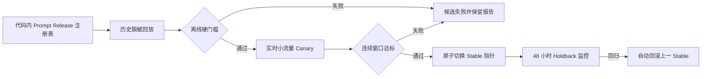

# Prompt Release 灰度治理与 Agent 工具异常恢复设计

## 背景

AutoHunter 当前保留 `current`、`legacy` 和 `modern` 三个 Worker 提示词 profile，默认使用 `current`。现有离线评估只检查约定关键词，可以验证静态契约和估算 token，但不能验证模型实际选择了什么工具、是否形成证据闭环、是否过早 `no_vuln`，也不能支持可审计的自动灰度、晋升和回滚。

上游提交 `965b61613e3a1786f4c01b177abfeffa26ac386c` 没有修改提示词正文，而是把所有历史别名统一解析为 `legacy`。本项目不采用该收敛方式：现有 `current` 在业务建模、单变量对照、信息影响判断、后门证据矩阵、结构化工具路由和 token 成本上更符合当前架构。需要升级的是提示词 release 治理、行为级评估、条件化打法覆盖和工具异常恢复，而不是把长版提示词重新设为默认。

## 目标

1. 将完整有效提示词控制面登记为不可变 Prompt Release，并为每个执行目标固定具体 release。
2. 使用脱敏历史 fixture 做无目标网络访问的行为级回放，通过后再进入实时小流量灰度。
3. 根据明确、可审计的硬门槛自动晋升 Candidate，并在回归时自动回滚。
4. 普通任务始终使用 Stable channel，不在普通前端暴露实验控制。
5. 为 `escalate` 和 `killsweep` 增加一致的工具异常响应，保证 tool call 配对完整并避免单次工具异常中断 Agent。
6. 保留 `legacy`、`modern` 和旧任务字段的读取兼容，不改变运行中目标使用的 release。

## 非目标

- 不在数据库中编辑或生成提示词正文。
- 不建设提示词可视化编辑平台。
- 不让同一实时目标同时运行 Stable 和 Candidate。
- 不在普通设置页、新建任务或编辑任务界面提供实验开关。
- 不把工具异常吞掉或伪装成成功结果。
- 不在本次升级中引入看板人工跳过目标功能。

## 核心原则

### 代码内不可变

提示词 release 随代码发布。自动化只能切换激活指针，不能修改正文。每个 release ID 在同一代码历史中只能对应一组固定组件和固定指纹。

### 完整控制面指纹

Release 指纹覆盖：实际渲染后的基础 Worker prompt、共享 policy block、playbook policy 内容、Worker 可见工具 schema 的规范化 JSON、组合顺序和渲染版本。不能只信任人工填写的 revision 字符串。运行时目标上下文和真实工具结果不进入 release 哈希，但其 schema 版本进入哈希。

### 目标级固定

目标首次领取时解析 channel 并固定具体 release ID。晋升、回滚、配置刷新和进程重启均不得改变已经固定的目标。

### 自动晋升不等于自动创作

Candidate 仍由开发者编写、测试并随代码部署。系统只对已注册 Candidate 做评估、灰度、晋升和回滚。

## 总体架构



## Prompt Release 注册表

新增 `app/agents/prompt_releases.py`，定义不可变 `PromptRelease`：

```python
@dataclass(frozen=True)
class PromptRelease:
    release_id: str
    label: str
    base_profile: str
    prompt_revision: str
    policy_revision: str
    playbook_revision: str
    tool_schema_revision: str
    promotable: bool
```

注册表提供纯函数：

```python
get_prompt_release(release_id: str) -> PromptRelease
resolve_prompt_release(channel_or_alias: str | None, *, stable_release_id: str) -> PromptRelease
render_worker_prompt(release: PromptRelease, src_type: str | bool | None) -> str
prompt_release_fingerprint(release: PromptRelease) -> str
```

约束：

- `release_id` 使用 `worker-YYYY-MM-DD-rN` 格式。
- `legacy` 和 `modern` 映射到固定兼容 release，`current` 映射到 Stable channel。
- 未知 alias 解析到 Stable，不解析到 Candidate。
- 数据库中的 release ID 在当前构建不存在时，记录错误并回退编译期 Stable，不能静默使用另一个 Candidate。
- `promotable=false` 的兼容 release 不允许作为自动晋升 Candidate。

首个 Stable 对应现有 `current` 的完整控制面。首个 Candidate 为 `worker-2026-07-27-r1`。

## 首个 Candidate 内容

Candidate 保留现有 `current` 的业务建模、六维假设、单变量与双账号对照、影响导向判断、独立路径侧面回读、后门证据矩阵和结构化工具选择，不恢复上游整段 `legacy`。

Candidate 通过 playbook 增加条件化短策略：

| 信号 | 注入路线 | 最低证据要求 |
|---|---|---|
| URL、webhook、proxy、preview、image、import 参数 | SSRF | 受控目标或允许范围内资源的服务端请求差异；错误文本不算访问成功 |
| XML、SOAP、Office/富文本导入 | XXE/解析 | 解析行为差异或允许范围内的受控资源读取；单纯接收 XML 不成立 |
| Shiro、Fastjson、Java 序列化、ViewState、Dubbo | 反序列化 | 可重复的解析或执行证据；指纹和报错只能作为线索 |
| JWT、Authorization、Bearer | Token/身份边界 | 声明或算法变化必须实际获得不同身份或受限资源；只解码 payload 不成立 |

没有对应信号时不注入，保持基础 prompt 紧凑。

## 数据模型

### Target 扩展

在 `Target` 增加 nullable 字段：

```text
prompt_release_id       String(80), indexed
prompt_experiment_id    String(32), indexed
prompt_cohort           String(20)  # stable/candidate/holdback/manual
```

首次领取 queued 目标时，在领取目标的同一数据库事务中写入三项。字段一旦非空，后续领取、重试和重启恢复只读取，不重新分组。

### PromptExperiment

新增 `prompt_experiments` 表：

```text
id                       String(32) PK
status                   String(20), indexed
stable_release_id        String(80)
candidate_release_id     String(80)
previous_stable_id       String(80)
seed                     String(64)
canary_percent           Float
thresholds               JSON
metrics                  JSON
failure_reason           Text
promotion_reason         Text
rollback_reason          Text
offline_started_at       DateTime nullable
live_started_at          DateTime nullable
promoted_at              DateTime nullable
rolled_back_at           DateTime nullable
created_at               DateTime
updated_at               DateTime
```

状态只允许：

```text
offline -> live -> promoted -> completed
offline -> failed
offline -> cancelled
live -> failed
live -> cancelled
promoted -> rolled_back
```

同一时间只允许一个 `offline`、`live` 或仍在 holdback 的 `promoted` 实验。创建实验时必须确认当前 Stable 与实验基线一致。

### PromptExperimentSample

新增 `prompt_experiment_samples` 表：

```text
id                       String(32) PK
experiment_id            FK prompt_experiments.id, indexed
phase                    String(20)  # offline/live/holdback
cohort                   String(20)
release_id               String(80)
case_id                  String(120)
run_number               Integer nullable
task_id                  String(32), indexed
target_id                String(32), indexed
src_type                 String(20)
route_id                 String(80)
terminal_verdict         String(30)
rounds                   Integer
tool_calls               Integer
tool_errors              Integer
agent_terminated_by_tool Boolean
prompt_tokens            Integer
completion_tokens        Integer
total_tokens             Integer
usage_complete           Boolean
finding_count            Integer
ai_accepted_count        Integer
human_passed_count       Integer
human_rejected_count     Integer
evidence_complete        Boolean
forbidden_action_count   Integer
missed_signal_count      Integer
metrics                  JSON
started_at               DateTime nullable
finished_at              DateTime nullable
created_at               DateTime
updated_at               DateTime
```

约束：

- 实时样本对 `(experiment_id, target_id)` 唯一。
- 离线样本对 `(experiment_id, case_id, release_id, run_number)` 唯一。
- 样本不保存密钥、Cookie、Authorization、完整原始 HTTP 包或提示词正文。
- 进程中断导致 token 不完整时设 `usage_complete=false`；该样本参与可靠性统计，但不参与成本均值。

## Stable 指针

复用 `SystemSettings.defaults`，新增：

```json
{
  "worker_prompt_channel": "stable",
  "stable_prompt_release_id": "worker-2026-07-15-r1"
}
```

晋升和回滚复用现有设置写事务与缓存发布。切换前执行 compare-and-set：只有数据库中的 Stable 仍等于实验的 `stable_release_id` 才允许更新。失败时实验进入 `failed`，不得覆盖维护者的并发修改。

## 离线行为回放

### Fixture

脱敏 fixture 存放于 `tests/fixtures/prompt_replay/`，每个 JSON 文件包含：

```text
schema_version
case_id
src_type
route_id
initial_context
scripted_tool_results
allowed_tools
forbidden_tools
expected_terminal_verdicts
required_evidence
max_rounds
max_total_tokens
historical_human_outcome
```

fixture 中的域名、账号、Cookie、Token、手机号、身份证号和业务标识必须替换为稳定占位符。加载器发现疑似未脱敏秘密时拒绝运行。

### 执行

- Stable 和 Candidate 使用相同 Provider、模型、温度、工具 schema、初始上下文和轮次预算。
- 每个 release 每个案例执行 3 次。
- 调用顺序按实验 seed 交错，避免某一版本固定先运行。
- 使用脚本化工具执行器；任何未在 fixture 声明的目标网络访问直接失败并计为禁止行为。
- 离线回放是真实 LLM 行为测试，不把关键词命中当作行为通过。

### 离线门槛

Candidate 进入 `live` 必须同时满足：

- 静态提示词契约通过率为 100%；
- `forbidden_action_count` 为 0；
- 每个关键 fixture 至少 2/3 次进入允许终态；
- 证据闭环率不低于 Stable；
- Agent 崩溃和未配对 tool call 为 0；
- 平均总 token 不超过 Stable 的 115%。

任一硬门槛失败时实验进入 `failed` 并保留完整聚合报告。

## 实时灰度

### 分组

Candidate 默认承接 10% 新目标。分组值为：

```text
sha256(experiment.seed + ":" + target.id) % 10000
```

值小于 `canary_percent * 100` 时进入 Candidate，否则进入 Stable。分组发生在 `_pop_queued()` 领取目标的事务内。同一目标只运行一个 cohort，避免重复请求和状态副作用。

### 使用量

LLM 调用同时记录 task 聚合和 target 聚合。每个 Worker 使用不可变 usage context：

```text
task_id
target_id
experiment_id
release_id
cohort
```

现有看板继续读取 task 聚合；实验样本读取 target 聚合。目标终态时把 target 使用量写入 Sample 并释放内存计数。

### 晋升最小样本

- 实时灰度至少运行 7 天；
- Stable 和 Candidate 均至少 100 个终态目标；
- Candidate 至少覆盖 5 个任务和 3 类打法路由；
- Candidate 至少有 20 条已人工复审 Finding；
- 未达到最小样本时保持 `live`，不得用零样本或少量偶然结果晋升。

### 晋升窗口

按自然日生成窗口。连续 3 个完整日窗口必须同时满足：

- 禁止行为、证据串线和 tool call 协议错误均为 0；
- Candidate 证据闭环率最多比 Stable 低 2 个百分点；
- Candidate 工具异常导致的 Agent 终止率不高于 Stable；
- Candidate 人工通过率最多比 Stable 低 2 个百分点；
- Candidate `no_vuln` 后被恢复或命中 missed signal 的比例最多比 Stable 高 3 个百分点；
- 并且满足以下至少一项：
  - 每百目标人工通过 Finding 数相对提升至少 10%；
  - 效果指标非劣，且每终态目标平均总 token 降低至少 15%。

分母为 0 的指标记为“样本不足”，不能按 0% 通过门槛。

## 自动晋升、Holdback 与回滚

### 晋升

晋升事务执行：

1. 锁定活动实验和 `SystemSettings` 单行；
2. 校验 Candidate 仍在当前构建注册且 `promotable=true`；
3. 校验 Stable compare-and-set；
4. 写入新的 `stable_prompt_release_id`；
5. 记录 `previous_stable_id`、指标快照、晋升原因和时间；
6. 将实验状态改为 `promoted` 并刷新设置缓存。

晋升只影响之后首次领取的目标。

### Holdback

晋升后 48 小时内，新 Stable 承接 90%，旧 Stable 承接 10%。使用相同稳定哈希，cohort 标记为 `candidate` 和 `holdback`。观察期通过后状态变为 `completed`，所有新目标使用新 Stable。

### 立即回滚

以下任一情况在实时灰度阶段令实验进入 `failed`，在晋升后的 holdback 阶段立即回滚：

- `forbidden_action_count > 0`；
- 当前构建无法解析新 Stable release；
- raw request/response 或 target 证据发生跨目标串线；
- tool call/result 协议配对错误。

### 窗口回滚

连续两个完整窗口出现任一情况时回滚：

- Agent 终止率比旧 Stable 高 2 个百分点以上；
- 人工驳回率比旧 Stable 高 5 个百分点以上；
- 证据闭环率比旧 Stable 低 2 个百分点以上。

回滚同样使用 compare-and-set。若 Stable 已被维护者手工修改，只记录冲突并停止自动写入。

## 实验 CLI

新增 `scripts/manage_prompt_experiment.py`：

```powershell
python scripts/manage_prompt_experiment.py start --candidate worker-2026-07-27-r1 --canary-percent 10
python scripts/manage_prompt_experiment.py status
python scripts/manage_prompt_experiment.py report --format json --out artifacts/prompt-experiment.json
python scripts/manage_prompt_experiment.py cancel --reason "停止本轮候选"
python scripts/manage_prompt_experiment.py rollback --reason "人工触发回滚"
```

行为约束：

- `start` 创建实验并立即执行离线回放；离线通过后自动进入 live。
- `status` 输出 release、阶段、样本量、窗口和未满足门槛。
- `report` 只输出脱敏指标和 fixture ID。
- `cancel` 只停止未晋升实验，不改变 Stable。
- `rollback` 只对处于 holdback 的已晋升实验生效。
- 命令返回非零退出码表示操作未完成；错误信息说明具体门槛或状态冲突。

## 前端与 API 兼容

- 普通设置页、新建任务和编辑任务移除 profile 下拉框。
- 新建任务不再主动写 `prompt_version`。
- API 继续接受和读取旧 `prompt_version`，用于历史任务和外部调用兼容。
- 明确指定固定 `legacy` 或 `modern` 的任务标记为 `manual` cohort，不参与实验。
- 看板 Worker 事件增加 `prompt_release_id` 和 `prompt_cohort`，但不增加实验控制按钮。

## 工具异常恢复

### 公共包装器

新增 `app/agents/tool_dispatch.py`：

```text
@dataclass(frozen=True)
class ToolDispatchOutcome:
    result: dict
    failed: bool
    retryable: bool
    error_kind: str

def dispatch_tool_safely(
    dispatch: Callable[[str, dict], dict],
    name: str,
    arguments: dict,
    *,
    emit: Callable,
) -> ToolDispatchOutcome
```

异常结果固定为：

```json
{
  "ok": false,
  "error": {
    "kind": "tool_exception",
    "retryable": true,
    "message": "经过脱敏和长度限制的错误摘要"
  }
}
```

### 行为

- 完整 traceback 只进入服务端日志。
- 面向模型和事件流的 message 使用现有秘密脱敏规则并限制长度。
- assistant 一轮发出多个 tool call 时，每个 call 都必须追加对应 tool response；单个失败不阻断其余 call。
- 任意成功工具调用会清零连续工具异常计数。
- 连续 3 次异常后追加用户提示，要求切换工具、缩小参数或收尾。
- 连续 5 次异常后结束当前 Agent。
- `escalate` 返回 `escalated=false` 和明确失败原因。
- `killsweep` 返回失败类别，不生成通杀成功结论。
- 取消信号保持最高优先级，不被包装成普通工具异常。

## 状态重算触发点

不增加常驻调度进程。以下事件调用 `PromptExperimentService.recompute()`：

- 离线回放写入结果；
- 实时目标进入终态；
- Finding 完成人工通过或驳回；
- archived Finding 被人工恢复；
- missed signal 状态变化；
- 应用启动恢复活动实验。

没有新数据时无需重复计算。日期窗口跨天后的首次事件会补算此前完整窗口。

## 迁移与恢复

- 新表和 Target 字段通过现有数据库迁移入口创建。
- 不批量回填历史目标的 release；历史目标只在再次领取时固定。
- `assigned/scanning` 目标升级部署后继续按任务旧 `prompt_version` 解析一次并固定。
- 应用启动时验证活动实验引用的 release。Candidate 缺失则实验失败；已晋升 Stable 缺失则回退 `previous_stable_id`，再回退编译期 Stable。
- 设置缓存、数据库行和注册表不一致时，以可解析的数据库具体 release ID 为准，并记录诊断事件。

## 测试策略

### Release 与兼容

- Release ID 唯一、对象不可变、指纹稳定。
- `current` 解析 Stable，`legacy/modern` 解析固定 release。
- 未知 alias 不进入 Candidate。
- 缺失 release 回退并记录错误。

### 回放

- fixture schema、脱敏扫描和重复 case ID。
- Stable/Candidate 交错顺序和每案例 3 次执行。
- 脚本化工具返回，未声明网络调用失败。
- 正确终态、禁止行为、证据闭环和 token 上限。

### 分组与固定

- 相同 target/seed 始终进入相同 cohort。
- 10% 边界计算正确。
- 并发领取只写入一次 release。
- 运行中晋升不换版，新目标使用新 Stable。
- 固定 `legacy/modern` 任务不进入实验。

### 指标与状态机

- 最小天数、目标数、任务数、路由数和人工样本数边界。
- 分母为 0 时不晋升。
- 连续三个窗口晋升，非连续窗口不晋升。
- compare-and-set 冲突不覆盖维护者配置。
- 立即回滚、连续窗口回滚和 48 小时完成。
- `usage_complete=false` 不进入成本均值。

### 工具异常

- 单工具异常生成配对 tool response。
- 多工具部分失败仍为每个 call 生成 response。
- 错误正文脱敏和截断。
- 成功调用重置计数。
- 第 3 次提示切换，第 5 次结构化结束。
- 取消不转成 `tool_exception`。

### 回归

- 现有 prompt profile、后门策略、企业策略、LLM protocol 和 orchestrator 测试全部通过。
- 后端全量 pytest、前端 Node 测试和 Vite build 通过。
- 工作区 diff 只包含设计覆盖的代码、测试、迁移和普通前端 profile 选择器移除。

## 实现拆分

后续实现分成两个独立计划和独立提交序列：

1. **Agent 工具异常恢复**：先完成公共包装器、`escalate/killsweep` 接入和回归测试，可独立发布。
2. **Prompt Release 治理**：再完成注册表、数据模型、离线回放、实时分组、指标、CLI、自动晋升及回滚。

第一部分不依赖实验数据模型；第二部分可以直接把第一部分产生的结构化工具异常计入实验指标。两部分最终执行一次共同的全量回归。

## 验收标准

1. 每个新领取目标都能追溯到具体 Prompt Release，运行中不会漂移。
2. Candidate 未通过离线硬门槛时不会获得实时目标。
3. 实时 Candidate 只处理稳定哈希命中的目标，同一目标不会双跑。
4. 未满足最小样本或连续窗口时不会自动晋升。
5. 晋升和回滚均有原子 compare-and-set、指标快照和原因记录。
6. 进程重启后实验、目标固定版本和 Stable 指针可恢复。
7. 普通用户不能从前端改变实验 profile，旧 API 数据仍可读取。
8. `escalate/killsweep` 的单次工具异常不再中断 Agent，连续异常能有限收敛。
9. 实验指标不持久化秘密、完整 HTTP 证据或提示词正文。
10. 首个 Candidate 只按信号注入 SSRF、XXE、反序列化和 JWT 短路线，不恢复 monolithic legacy prompt。
